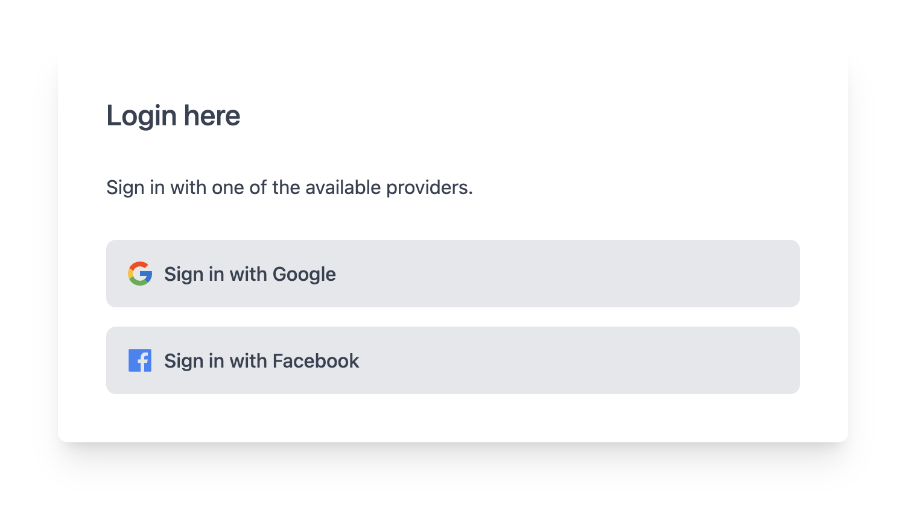

## Authy App

> This is authentication web-app with react as mainly for demonstration and general reference.

Featuring:

- This is a [Next.js](https://nextjs.org/) project bootstrapped with [`create-next-app`](https://github.com/vercel/next.js/tree/canary/packages/create-next-app).
- Added **tailwindcss** support by following the [Install Tailwind CSS with Next.js](https://tailwindcss.com/docs/guides/nextjs) guide.
- Added [firebase](https://www.npmjs.com/package/firebase) support and functions to store and query user data.
- Register the firebase project as a Web-App to get your **Firebase SDK** to make use of functions like `getAuth`.
- Providers used are Google and Facebook.
- [React Firebase Hooks](https://www.npmjs.com/package/react-firebase-hooks) that offers a set of reusable React Hooks for Firebase.
- The `react-firebase-hooks/auth` helps with firebase interaction within our React application.
- The `useAuthState` hook is used to Retrieve and monitor the authentication state from Firebase..

Installation:

- `npx create-next-app my-project`
- `cd my-project`
- `npm install -D tailwindcss postcss autoprefixer`
- `npx tailwindcss init -p`
- `npm install --save firebase`
- `npm install --save react-firebase-hooks`

Regards,  
Luigi Lupini  
 
I ❤️ all things (🇮🇹 / 🛵 / ☕️ / 👨‍👩‍👧) 
